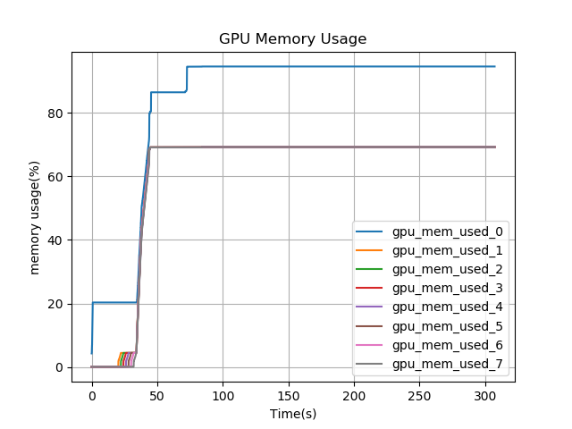
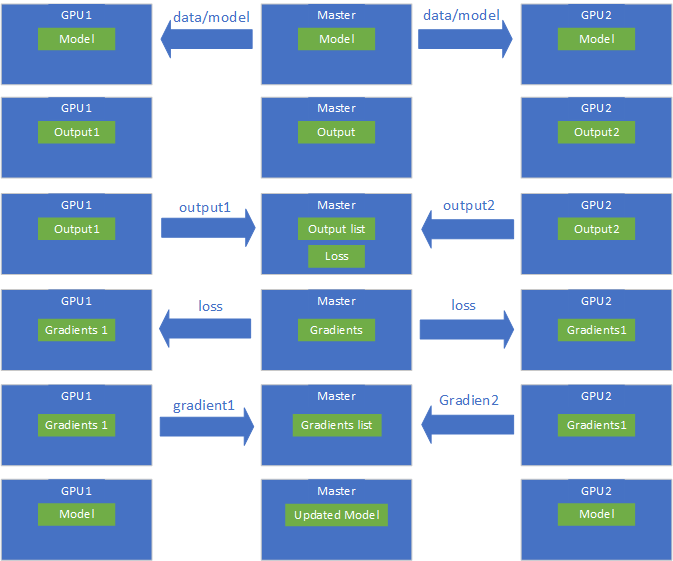
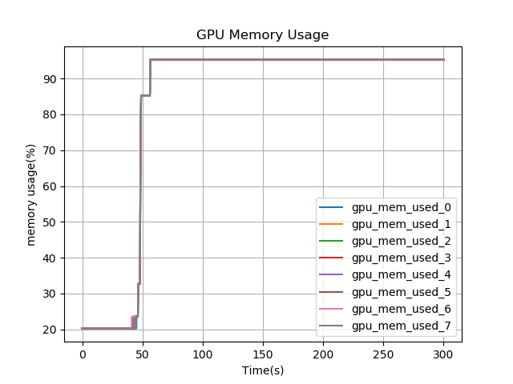
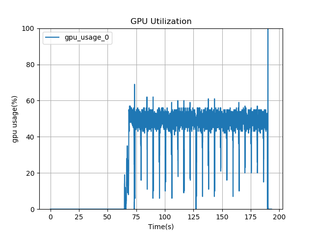
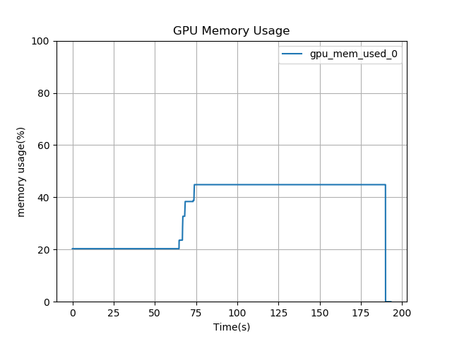
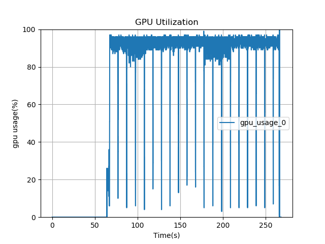
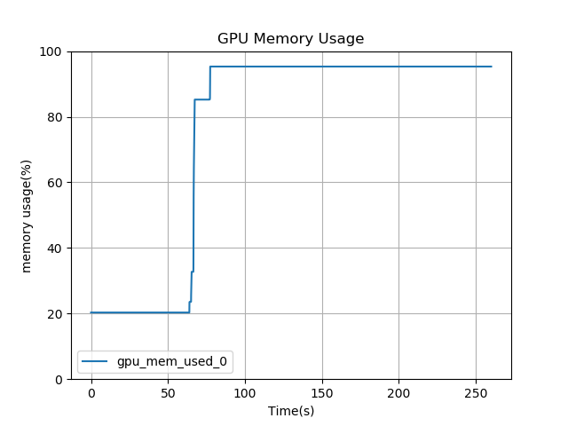
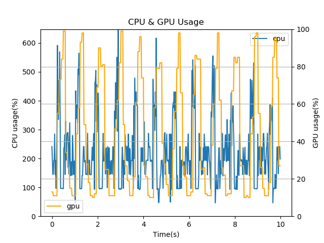
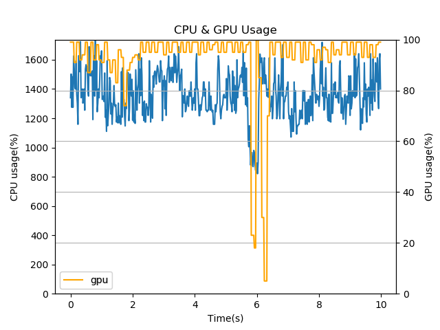

# Typical Examples
  Here is several typical examples and solution of several profiling
  result.
### There is maldistribution of the GPU memory between the multiple GPUs.
- **Instance**  
  When using the multiple GPU cards, sometimes it will be detected that
  each card has different memory utilization. The utilization will be
  like as follow:  
    
- **Reason**  
  In the deep learning model, GPU card will train the data, compute the
  loss and gradient and reduce the gradient to optimize the model. When
  using multiple cards, each card will run the forward and backward and
  the gradients will be sent to a server which runs an reduce operation
  to compute averaged gradients. The averaged gradients are then
  transmitted back to each GPU card to update the model parameters.  
  When the machine structure is "one-machine, multiple cards", one of
  the GPU card will be chosen to be the master GPU. The task of the
  master GPU is to transmit the data to each card, receive the output of
  each card, then compute and transmit the loss of each card. At last,
  the master GPU will receive the gradients from all the cards and
  reduce them, finally it will update the model. Here is the flow chart:  
    
  From the chart, the master card does some extra works except the same
  work that each card does: loss calculation, gradient reduction and the
  parameter update, because of which the master card will be allocated
  more data, then the memory utilization of the master card will be more
  than others.
- **How to Fix**  
  One of the solution is to use the horovod API to fix it. Horovod API
  can help to change the model from Tree-Reduce to Ring-Reduce with
  NCCL, which can reduce the training time and solve the uneven GPU
  utilization. The example code is as follow:  
  ```Python
    import horovod.torch as hvd  # Take pytorch for example
    hvd.init()
    torch.cuda.set_device(hvd.local_rank())
  ```  
  More information can be gotten at
  [horovod](https://github.com/horovod/horovod).
- **After Fixing**  
  After using the horovod API, the GPU memory usage in each card is
  uniform.  
  
### GPU utilization and GPU memory still have free resource.
- **Instance**  
  The deep learning model will cost the resource of the GPU while it is
  running. If there is much resource not being used, it is a kind of
  wasting. Here is a typical example that wasting the hardware resource.  
  
    
  It shows that the GPU utilization is always at about 50% and the max
  of GPU memory usage is at about 45%. There is still much resource can
  be used in the hardware.
- **Reason**  
  The GPU memory has free means that the training data is not enough for
  one batch in each epoch. The GPU utilization has free means that the
  computational complexity in one batch is not enough.
- **How to Fix**  
  If the GPU memory has free, one of the solution is to increase the
  data volume in one batch. The more data will use more GPU memory.  
  If the GPU utilization has free, one of the solution is to use the
  Kernel Fusion, like XLA in tensorflow. The Kernel Fusion can reduce
  the cost of platform invoking and kernel launching, which can reduce
  the resource wasting and increase the GPU utilization.
- **After Fixing**  
  As the example above, after increasing the batch size, the hardware
  information is as below:  
  
    
  It is obvious that the average of the GPU utilization increasing more
  than before, closed to 100%. And the max of the GPU memory usage is
  also about 100%.
### The utilization of GPU and CPU raise alternately.
- **Instance**  
  In a running model, the CPU and the GPU work for different tasks. The
  CPU will load the data from disk or memory and process it to be able
  to be used by the GPU, then the GPU will train the processed data.  
  According to the traditional way, there is a typical phenomenon that
  the CPU and GPU utilization raise to its max value and then fall to
  its min value alternately, which is showed as follow:  
    
  There are obvious peaks and bottoms in the CPU and GPU usage. 
- **Reason**  
  The raising alternately of the GPU and CPU usage means that the two
  hardware work alternately. Normally, the CPU prepares the data and
  then the GPU trains the data. The GPU is idle while the CPU is
  preparing the next data, and the CPU is the same while the GPU is
  training. The GPU and CPU work as the sequence which makes the system
  inefficient.
- **How to Fix**  
  The best solution is to make the CPU and GPU run as parallel. One of
  the solution is to use the input pipeline. In the pytorch, there is a
  official package called `DataLoader` can solve the problem. This class
  will do the prefetch, which will make the CPU pre-process the data for
  the next batch while the GPU is training the data this batch. This
  mechanism will solve the problem that the CPU and the GPU are idle
  alternately efficiently.  
  The example code is as follow:  
  ```Python
    import torch.utils.data.distributed
    
    # your code
    
    train_sampler = torch.utils.data.distributed.DistributedSampler(train_data)
    train_batches = torch.utils.data.DataLoader(train_data, sampler=train_sampler)
   ```
  For TensorFlow, the `Dataset` class can help to package the data with
  pipeline, which can do the same work.
- **After Fixing**  
  As the example above, after changing the code structure, the CPU and
  GPU information is as below:  
    
  It can be seen that at most time, the value of the GPU usage is at a
  high level, closed to 100%. And the usage of CPU is also much more
  than before. At the same time, the fluctuation of the data is less
  than before.